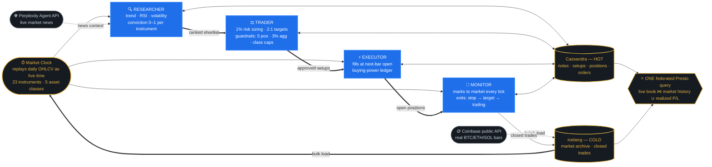

# TradeCrew — Multi-Agent AI Trading Platform

[](https://www.ibm.com/products/watsonx-data)
[](https://claude.com/claude-code)
[](https://docs.perplexity.ai)
[](https://tradecrew-dashboard.vercel.app)
[](test-plan.md)

Four autonomous agents — **Researcher → Trader → Executor → Monitor** —
paper-trade a simulated live market across five asset classes on an
AI-ready data platform: Apache Cassandra (hot operational store) and
Apache Iceberg (cold analytical archive), federated by the Presto
engine on **IBM watsonx.data**, with hard risk guardrails and a
complete per-trade audit trail. Built **spec-first** (requirements →
design → OpenAPI → tasks → tests → code) entirely through agentic
coding.

**Live dashboard**: https://tradecrew-dashboard.vercel.app
*(needs the local API running — see below)*

## Built at IBM TechXchange

This project was designed and shipped end-to-end in a single afternoon
at **"How to Provide Agents an AI-Ready Data Platform" — an
[IBM TechXchange Workshop](https://www.ibm.com/events/reg/flow/ibm/caa9mtmb/landing/page/landing)**,
held **June 10, 2026 at IBM Innovation Studio New York** (1 Madison
Avenue, NYC). The workshop pairs spec-driven development and agentic
coding with a governed, federated data foundation on IBM watsonx.data —
this repository is the resulting real, working application, presented
by **[Enso Labs](https://ensolabs.ai)** (Sav Banerjee). Workshop
infrastructure and sample-data bundle by the IBM watsonx.data workshop
team via [IBM TechZone](https://techzone.ibm.com)
([bundle repo](https://github.com/jamesc127/wxd-workshop-bundles)).

## Technology stack

| Layer | Technology |
|---|---|
| Lakehouse / data fabric | **IBM watsonx.data** — Presto federated query engine over **Apache Iceberg** (Parquet on object storage); deployed on Red Hat OpenShift via IBM TechZone; authenticated through IBM Software Hub (Cloud Pak for Data API) |
| Hot operational store | **Apache Cassandra** (TLS-passthrough OpenShift route, per-user keyspaces) |
| Agentic coding | **Anthropic Claude Fable 5** via **Claude Code** — wrote the spec stack, all application code, tests, and this README from the workshop's schemas |
| Live market intelligence | **Perplexity Agent API** (`/v1/agent`, web-search tooling) enriching research signals with real-time news |
| Crypto market data | **Coinbase Exchange** public candles API (BTC/ETH/SOL daily OHLCV) |
| Backend | Python 3.9 · asyncio · FastAPI · cassandra-driver · httpx |
| Frontend & hosting | **Next.js 14** on **Vercel** |
| Spec & quality | OpenAPI 3.1 contract · pytest (33 tests, every requirement covered) |

## How the agents connect



Every handoff is durable, auditable state in Cassandra (note → setup →
position → order, linked by IDs), synchronized by one market clock. The
Trader and Executor are serial gates — that's what makes the risk
invariants enforceable.

## The spec stack (read in order)
| File | What it is |
|---|---|
| `Requirements.md` | REQ-001..024 with acceptance criteria, personas, user flows |
| `design.md` | Architecture, data access patterns vs. actual tables, routing invariant |
| `openapi.yaml` | OpenAPI 3.1 — 14 operations, every one mapped to REQ-IDs |
| `todo.md` | Build plan, all 26 tasks checked off |
| `test-plan.md` | Every REQ → a test; 33 passing |
| `DEMO.md` | 3-minute walkthrough |

## Run it
```bash
./setup/connect-workshop.sh <user> '<password>'   # cluster connection + venv
.venv/bin/pip install -r requirements.txt
.venv/bin/python -m src.setup_tables              # idempotent DDL
.venv/bin/python -m src.load_crypto               # real BTC/ETH/SOL (Coinbase, no key)
.venv/bin/python -m pytest tests/ -q              # 33 tests

.venv/bin/python main.py --pace 1                 # unattended console session
# or with the API + dashboard:
.venv/bin/uvicorn src.api:app --port 8031         # then open the Vercel URL
```
Optional: `PERPLEXITY_API_KEY` in `.env` enriches shortlisted research
notes with live market news (Agent API, ~$0.01/note). Without it the
system runs identically.

## Architecture in one paragraph
A market clock replays the cluster's daily OHLCV as a live feed (no
lookahead). The Researcher scores 23 instruments across 5 asset classes
and shortlists with class breadth; the Trader sizes at 1% risk with
hard guardrails (max positions, 3% aggregate risk, per-class caps,
risk-tier gate) and names the guardrail on every rejection; the
Executor fills at next-bar open under buying-power accounting; the
Monitor marks to market every tick, raises trailing stops monotonically
and exits on stop/target/trail. Hot reads are single-partition
Cassandra CQL; analytics go through Presto — including the
centerpiece: **one federated SQL statement joining live Cassandra
positions to the Iceberg market archive and closed-trade history.**

## Notes
- Paper trading only. The workshop cluster is torn down after the
  event; the data plane must be replaced for the app to run beyond it
  (see `design.md` §8.3).
- Frontend is `frontend/` (Next.js, deployed on Vercel); the dashboard
  calls the API at `NEXT_PUBLIC_API_BASE` (default `http://localhost:8031`).
